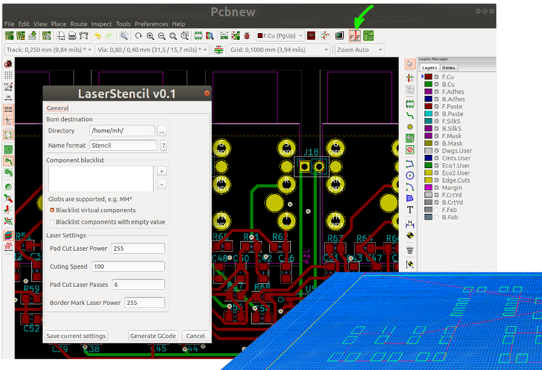

# GCode Laser Stencil Generator for KiCAD PCBs
 
KiCAD Pcbnew plugin to generat laser cutter GCode files for solder paste stencils

Generated GCode files:

* Front side stencil border: for adjusting the position of the stencil
* Front side stencil containing border markings and footprint cuttings
* Back side stencil border
* Back side stencil cutting

The plugin is based on the awesome [iBom plugin](https://github.com/openscopeproject/InteractiveHtmlBom) code.

# Installation

Copy the whole `laser-stencil` folder (including all files and sub-folders) into your KiCAD plugin directory.

* Windows
  * `%APPDATA%\kicad\scripting\plugins`
  * (e.g. `C:\Users\[USERNAME]\AppData\Roaming\kicad\scripting\plugins`)

* Linux
  * `~/.kicad/scripting/plugins` or
  * `~/.kicad_plugins`

* MacOS
  * `~/Library/Application Support/kicad/scripting/plugins`
  * or on newer versions: `~/Library/Preferences/kicad/scripting/plugins`

Restart of Pcbnew.

The plugin icon should appear in the tool bar.

# TODO

* process other than "roundrect" pads 
* make "roundrect" with rounded corners, not simply rectangular
* clean up non used code

# Feedback welcome

Please feel free to create a GitHub Issue for feature requests, issues or questions.

# License

MIT License, Copyright (c) 2021 ma-ha